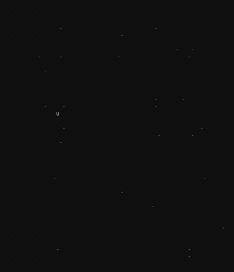

# split-flap-ascii

Split-flap display effect for ASCII characters — like the departure boards in old train stations. Each cell independently flips through intermediate characters before settling on its target, with configurable orchestration patterns across the grid.



## Install

```bash
npm install split-flap-ascii
```

## Quick start

```ts
import { SplitFlapDisplay, patterns } from "split-flap-ascii";

const board = new SplitFlapDisplay(document.getElementById("board"), {
  rows: 6,
  cols: 36,
  flipSpeed: 35,
  flip: { drumRolls: 4 },
  noise: 0.3,
  layout: { font: "monospace", fontSize: 18 },
});

// Set text immediately
board.setText(["HELLO WORLD"]);

// Flip to new text with a wave pattern
await board.flipTo(
  ["DEPARTURES", "NEW YORK  14:30  ON TIME"],
  patterns.wave("left", 25)
);

// Force-flip all non-empty cells even if unchanged
await board.flipTo(board.getText(), patterns.random(600), true);
```

### Browser (IIFE)

```html
<script src="dist/split-flap.iife.js"></script>
<script>
  const { SplitFlapDisplay, patterns } = SplitFlap;
  // same API as above
</script>
```

## Architecture

The library is split into two layers:

- **`core/`** — Pure logic with no DOM dependency: flip step computation, grid state, animation timing, pattern generators. Usable in Node, terminal renderers, or custom frontends.
- **`dom/`** — DOM renderer that drives a grid of `<span>` elements with `requestAnimationFrame`.

## API

### `SplitFlapDisplay`

```ts
new SplitFlapDisplay(container: HTMLElement, config: DisplayConfig)
```

| Option | Type | Default | Description |
|---|---|---|---|
| `rows` | `number` | — | Number of rows |
| `cols` | `number` | — | Number of columns |
| `flip` | `Partial<FlipConfig>` | — | Flip behavior (see below) |
| `flipSpeed` | `number` | `35` | Milliseconds per animation step |
| `noise` | `number` | `0` | Per-cell randomization, 0–1 (see [Noise](#noise)) |
| `layout` | `Partial<LayoutConfig>` | — | Visual styling (see below) |

| Method | Description |
|---|---|
| `setText(lines: string[])` | Set all cells immediately, no animation |
| `flipTo(lines, pattern?, force?): Promise` | Animate to new text (see [Force flip](#force-flip)) |
| `getText(): string[]` | Read current display text |
| `cellAt(row, col): HTMLElement` | Access a cell's DOM element |
| `cancelAll()` | Stop all in-progress animations |
| `resize(rows, cols)` | Resize the grid, rebuilds DOM |
| `setLayout(partial)` | Update layout config, rebuilds DOM |
| `setFlipConfig(partial)` | Update flip config (drumRolls, flipChar, charset) |
| `setFlipSpeed(ms)` | Update animation step duration |
| `setNoise(n)` | Set noise level, 0–1 |

### `FlipConfig`

| Option | Default | Description |
|---|---|---|
| `flipChar` | `"-"` | Character shown during flip transition |
| `flipSpeed` | `35` | Milliseconds per animation step |
| `drumRolls` | `4` | Random characters to cycle through before settling |
| `charset` | `A–Z 0–9` | Pool for drum roll characters |

### `LayoutConfig`

| Option | Default | Description |
|---|---|---|
| `font` | `"monospace"` | Font family |
| `fontSize` | `18` | Font size in px |
| `cellWidth` | `null` (auto) | Cell width in px |
| `cellHeight` | `null` (auto) | Cell height in px |
| `cellGap` | `0` | Gap between cells in px |
| `rowGap` | `0` | Gap between rows in px |
| `color` | `"#ddd"` | Text color |
| `flipColor` | `"#666"` | Color during flip transition |

### Defaults

Both config defaults are exported so you can read or spread from them:

```ts
import { DEFAULT_FLIP_CONFIG, DEFAULT_LAYOUT } from "split-flap-ascii";

// Override just what you need
const myFlip = { ...DEFAULT_FLIP_CONFIG, drumRolls: 8 };
const myLayout = { ...DEFAULT_LAYOUT, color: "#0f0" };
```

### `patterns`

Delay functions that control the order cells flip. Each factory returns a `PatternFn = (row, col, rows, cols) => delayMs`.

| Pattern | Default args | Description |
|---|---|---|
| `patterns.simultaneous()` | — | All cells flip at once (delay = 0) |
| `patterns.sequential(delayPerCell)` | `30` ms | Left-to-right, top-to-bottom. Each cell starts `delayPerCell` ms after the previous |
| `patterns.random(maxDelay)` | `600` ms | Each cell gets a random delay between 0 and `maxDelay` |
| `patterns.fromCorner(corner, speed)` | `"tl"`, `18` ms/cell | Expand from a corner. `speed` is ms per unit of Manhattan distance. Corners: `"tl"` `"tr"` `"bl"` `"br"` |
| `patterns.fromCenter(speed)` | `22` ms/cell | Radial expansion from center. `speed` is ms per unit of Euclidean distance |
| `patterns.wave(direction, speed)` | `"left"`, `25` ms/col | Sweep across one axis. `speed` is ms per row or column. Directions: `"left"` `"right"` `"top"` `"bottom"` |
| `patterns.diagonal(speed)` | `22` ms/cell | Top-left diagonal sweep. `speed` is ms per diagonal index |
| `patterns.custom(fn)` | — | Pass your own `(row, col, rows, cols) => delayMs` |

### Noise

The `noise` parameter (0–1) adds organic variation so cells don't flip in lockstep. It affects three things:

- **Start delay** — each cell's pattern delay gets a random offset, up to `noise * averageCellDuration` ms
- **Step speed** — each cell's flip speed is randomly scaled between `0.2x` and `1 + noise` of the base speed
- **Drum rolls** — each cell gets a randomly varied number of rolls (e.g. at `noise=0.5`, a base of 4 rolls may become 2–6)

`0` is perfectly mechanical. `0.2–0.4` feels natural. Above `0.6` gets chaotic.

### Force flip

By default, `flipTo` skips cells where the character hasn't changed. Pass `force = true` as the third argument to re-animate every non-empty cell:

```ts
// Only changed cells flip
await board.flipTo(newLines, patterns.wave("left", 25));

// All non-empty cells flip, even if text is the same
await board.flipTo(board.getText(), patterns.wave("left", 25), true);
```

This is useful for pattern demos, visual refreshes, or "shuffle" effects where the content stays the same but you want the animation.

### Headless usage (core only)

For non-DOM environments (Node, terminal, canvas, WebGL), use the core API directly:

```ts
import { FlipGrid, runFlipPlan, patterns } from "split-flap-ascii";

const grid = new FlipGrid(4, 30, { drumRolls: 4 });
grid.setText(["HELLO WORLD"]);

const jobs = grid.plan(["GOODBYE"], patterns.wave("left", 25));
grid.setText(["GOODBYE"]);

const handle = runFlipPlan(jobs, 35, (row, col, step) => {
  // step.char — the character to display
  // step.intermediate — true during flip transition, false on settle
});

await handle.promise;

// Cancel mid-animation (resolves the promise immediately)
handle.cancel();
```

For single-cell computation without a grid:

```ts
import { computeFlipSteps } from "split-flap-ascii";

const steps = computeFlipSteps("A", "Z", { drumRolls: 4 });
// steps: [{ char: "-", intermediate: true }, { char: "M", intermediate: false }, ...]
```

`runFlipPlan` uses a single `setInterval` tick internally. `handle.cancel()` clears the timer and resolves the promise so `await` callers don't hang.

## CSS classes

The library creates DOM elements with these classes:

| Class | Element |
|---|---|
| `.sf-row` | One row of cells |
| `.sf-cell` | Individual cell |

## Demo

```bash
npm run build
# open index.html in browser
```

## License

MIT
